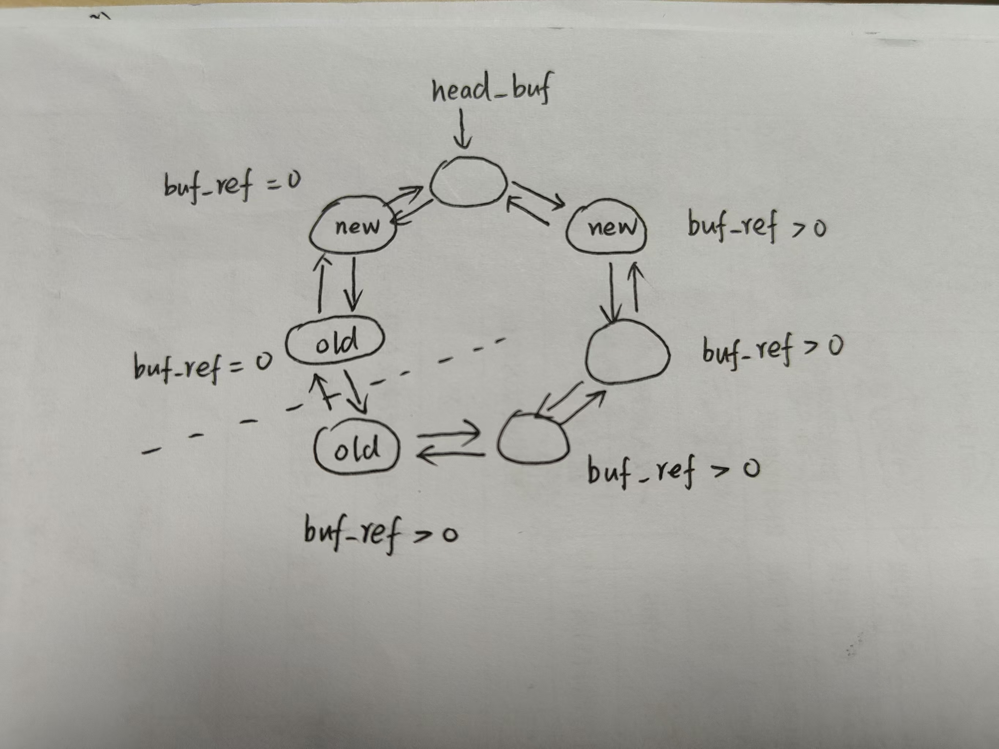

# LAB-7: 文件系统 之 底层设备

## 代码组织结构

ECNU-OSLAB  
├── **include**  
│   ├── dev  
│   │   ├── virtio.h **(NEW)**   
│   │   ├── vio.h **(NEW)**  
│   │   ├── timer.h   
│   │   ├── plic.h  
│   │   └── uart.h  
│   ├── lib  
│   │   ├── print.h  
│   │   ├── lock.h  
│   │   └── str.h  
│   ├── proc  
│   │   ├── proc.h  
│   │   ├── initcode.h  
│   │   └── cpu.h  
│   ├── mem  
│   │   ├── mmap.h  
│   │   ├── pmem.h  
│   │   └── vmem.h  
│   ├── fs  
│   │   ├── buf.h **(NEW)**  
│   │   ├── fs.h **(NEW)**  
│   │   └── bitmap.h **(NEW)**  
│   ├── trap  
│   │   └── trap.h  
│   ├── syscall  
│   │   ├── syscall.h  
│   │   ├── sysfunc.h  
│   │   └── sysnum.h  
│   ├── common.h **(CHANGE)** 新增全局变量BLOCK_SIZE  
│   ├── memlayout.h **(CHANGE)** 新增磁盘驱动相关定义  
│   └── riscv.h  
├── **kernel**  
│   ├── boot  
│   │   ├── main.c **(CHANGE)** 日常更新  
│   │   ├── start.c  
│   │   ├── entry.S  
│   │   └── Makefile  
│   ├── dev  
│   │   ├── virtio.c **(NEW)**  
│   │   ├── uart.c  
│   │   ├── timer.c  
│   │   ├── plic.c  
│   │   └── Makefile  
│   ├── lib  
│   │   ├── print.c  
│   │   ├── spinlock.c  
│   │   ├── sleeplock.c   
│   │   ├── str.c  
│   │   └── Makefile    
│   ├── proc  
│   │   ├── cpu.c  
│   │   ├── proc.c **(CHANGE)** 修改fork_return()  
│   │   ├── swtch.S  
│   │   └── Makefile  
│   ├── mem  
│   │   ├── pmem.c  
│   │   ├── kvm.c **(CHANGE)** 内核页表添加磁盘地址映射  
│   │   ├── uvm.c  
│   │   ├── mmap.c  
│   │   └── Makefile  
│   ├── fs  
│   │   ├── buf.c **(TODO)**  
│   │   ├── fs.c **(TODO)**  
│   │   ├── bitmap.c **(TODO)**  
│   │   └── Makefile **(NEW)**  
│   ├── syscall  
│   │   ├── syscall.c  
│   │   ├── sysfunc.c  
│   │   └── Makefile  
│   ├── trap  
│   │   ├── trap_kernel.c **(CHANGE)** 增加磁盘中断处理  
│   │   ├── trap_user.c  
│   │   ├── trap.S  
│   │   ├── trampoline.S  
│   │   └── Makefile  
│   ├── Makefile  
│   └── kernel.ld  
├── **mkfs**  
│   ├── mkfs.c  **(NEW)**  
│   └── Makefile **(NEW)**  
├── **user**  
│   ├── syscall_arch.h  
│   ├── syscall_num.h  
│   ├── sys.h  
│   ├── initcode.c  
│   └── Makefile  
├── Makefile **(CHANGE)** 支持mkfs  
└── common.mk  

**标记说明**

1. **TODO** 本次新增的文件 + 其中有函数待实现 (核心部分)

2. **NEW**  本次新增的文件 + 无需做修改 (辅助部分)

3. **CHANGE** 本来就有的文件 + 需要做修改 或 助教做了修改 (整体兼容)

## 实验概览

到目前为止, 我们已经完成了6次实验, 你应该注意到一件事: 一切操作都发生在内存和寄存器里

然而内存通常是易失性存储, 我们需要在断电后仍能长期保持数据的方法

从本次实验开始, 我们将引入外存的概念: qemu为我们提供了磁盘的抽象

首先要在 **QEMUOPTS** 中添加文件系统映像和磁盘块设备的选项

```
QEMUOPTS += -drive file=$(FS_IMG),if=none,format=raw,id=x0
QEMUOPTS += -device virtio-blk-device,drive=x0,bus=virtio-mmio-bus.0
```

它会把一个名为 **$(FS_IMG)** 的文件作为操作系统的文件系统映像装入QEMU模拟的虚拟磁盘

这是文件系统故事的起点

## 实验一: 理解磁盘映像的制作过程

**$(FS_IMG)** 这个磁盘映像是怎么来的呢? 它的秘密都在 **mkfs** 文件夹下的 **mkfs.c** 文件中

磁盘在文件系统角度可以理解为一个以 **block** 为读写单位的大数组

在我们的构想中, 磁盘的布局是这样的:

```
disk layout: [ super block | inode bitmap | inode blocks | data bitmap | data blocks ]
```

- **super block** 包括磁盘和磁盘上文件系统的重要元数据

- **inode bitmap** 标记 inode blocks 区域里各个 inode 的分配情况 (0:可分配 1:已分配)

- **inode blocks** 这个区域由若干连续的 inode 组成

- **data bitmap** 标记 data blocks 区域里各个 block 的分配情况 (0:可分配 1:已分配)

- **data blocks** 这个区域由若干连续的 block 组成

在本次实验中, 你不需要关心 inode 的结构, 只需当它是一种数据格式即可

也不需要关心文件等上层概念, 你只需要关心三件事情: block 的读写、super block、bitmap

mkfs.c 会填写 super block 中的信息, 其他四个区域会全部填写为 0

这个非常简单的磁盘映像就制作完毕了

## 实验二: 磁盘驱动

磁盘映像制作好了, 但是我们还没有办法读写它, 好在 QEMU 为我们提供了一套读写虚拟磁盘的方法

磁盘驱动的实现涉及三个部分:

- **virtio.c** 这个文件定义了磁盘的数据结构, 由于非常复杂且涉及硬件规范, 所以助教已经给出完整代码

    你只需要了解它为上层提供的接口即可

- **kvm.c** 和 PLIC、CLINT、UART一样, 由于使用了内存映射寄存器, 需要在内核页表中加入virtio的映射

- **trap_kernel.c** 和时钟中断、UART中断一样, virtio 也需要在中断发生时调用中断响应函数

virtio.c 里和xv6有一点不一样 (215到219行) 由于不使用 `kvmpa()`, 所以需要为 `vm_getpte()` 增加一条规则

当传入的 pgtbl == NULL 时, 意味着默认使用 kernel_pgtbl, 需要你实现这件事

当你阅读 virtio.c 这个文件时, 你会发现它不是完全独立的, 它依赖一个叫 **buf_t** 的数据结构, 这个 **buf_t** 是做什么的呢?

## 实验三: buf层的实现 (困难)

首先你应该考虑一个问题：读写磁盘到底是一个什么过程呢?

- 第一步应该是主机向磁盘发送一个读请求, 这个请求应该包括两个信息: 要读取的block序号 + 读到的内容放到内存中何处

- 第二步应该是磁盘响应请求并完成数据传递任务

- 第三步应该是主机查看内存中读到的数据, 可能做一些修改

- 如果做了修改, 第四步应该要写回磁盘

从内存的角度考虑, 需要在内存里开辟一段空间(BLOCK_SIZE大小)用于暂存磁盘里读入的block

同时还需要记录这块空间对应哪个磁盘里的block

于是, 我们可以设计一个名为 **buf_t** 的数据结构

```c
typedef struct buf {
    /* 
        睡眠锁: 保护 data[BLOCK_SIZE] + disk
        block_num + buf_ref 由 lk_buf_cache保护
    */
    sleeplock_t slk;

    uint32 block_num; // 对应的磁盘block编号
    uint8  data[BLOCK_SIZE]; // block数据的缓存
    
    uint32 buf_ref; // 还有多少处引用没有释放 
    bool disk;      // 在磁盘驱动中使用

} buf_t;
```

除了我们提到的 block_num 和 data 字段, 这里还有其他三个字段

- disk 字段是 virtio.c 用到的, 我们不用关心

- slk 字段出现说明 buf_t 是存在竞争的, 有并发风险

- buf_ref 字段用于记录有多少处引用还没有释放, 为上层服务

和 **mmap_region_t** 一样, 我们需要把 **buf_t** 这种资源组织成全局的仓库

```c
// 将buf包装成双向循环链表的node
typedef struct buf_node {
    buf_t buf;
    struct buf_node* next;
    struct buf_node* prev;
} buf_node_t;

// buf cache
static buf_node_t buf_cache[N_BLOCK_BUF];
static buf_node_t head_buf; // ->next 已分配 ->prev 可分配
static spinlock_t lk_buf_cache; // 这个锁负责保护 链式结构 + buf_ref + block_num
```

组织结构是双向循环链表, 以 **head_buf** 为链表的头节点, **buf_cache** 里的节点作为可分配回收的资源节点

为了抽象链表的操作, 助教提供了 `insert_head()` 函数, 它负责从从链表里抽出一个 **buf_node_t**,

然后插入 head_buf.next 或者 head_buf.prev, 在后面的 `init()` `read()` `release()` 函数中均有使用

对于 `buf_init()` 函数, 它负责三个 **static** 的数据结构的初始化, 以及双向循环链表的组织

剩下的三个函数通常会组合使用:

```c
but_t* buf = buf_read(block_num);
do something on buf->data ......
buf_write(buf);
but_release(buf);
```

为了充分利用内存里的 **buf**, 我们计划采用 LRU 算法和 lazy write 策略

首先解释 LRU 算法, 这里有一个简单的示意图:



图片可以分为三个部分: **head_buf** + **buf_ref > 0 的 LRU 链** + **buf_ref = 0 的 LRU 链**

head_buf 是置身事外的, 它只用稳定当好一个不被分配回收的 **head** 即可

head_buf.next 是 buf_ref 字段大于 0 (即有人正在使用) 的 buf_t 构成的 LRU 链

head_buf.prev 是 buf_ref 字段等于 0 (即无人正在使用) 的 buf_t 构成的 LRU 链

越靠近 head_buf 的 buf 越新, 也就最近经常访问的; 越远离 head_buf 的 buf 越老, 也就是最近没怎么访问的

buf_ref = 0 的 buf 如果被访问(buf_read), 就会成为 buf_head.next, 同时 buf_ref++

buf_ref > 0 的 buf 如果被访问(buf_read), 就会成为 buf_head.next, 同时 buf_ref++

buf_ref == 1 的 buf 如果被释放(buf_release), 就会成为 buf_head.prev, 同时 buf_ref = 0

如果需要一个空闲(buf_ref == 0)的 buf, 那么会选择 buf_ref == 0 的那条 LRU 链里最老的 buf (虚线上面)

通过这套逻辑, 我们可以保证 buf 的使用效率保持在较高水平

接下来解释 lazy write:

在前面提到的三个函数组合中, `buf_write()` 并不总是必要的, 尽管你可能修改了 **buf->data**

原因在于访问某个 block 时, `buf_read()` 会首先检查在 **buf_cache** 里是否存在最新的副本

如果存在就直接使用这个副本的数据而不去磁盘找, 因此你的修改是生效了的

只需在特定时机(比如文件要关闭了)或者 **buf_cache** 空间不足时把这个 block 写回磁盘即可

这样做可以减少写磁盘的次数

至此, 你已经了解了 buf 层需要做的事情, 尝试实现 buf.c 中的函数

需要注意的两点:

- 存在两种锁, lk_buf_cache 和 buf->slk, 考虑如何使用它们

- 考虑如何在 `buf_read()` 和 `buf_release()` 中实现上述两种策略

## 实验四: super block 的读取及文件系统初始化

这部分的工作分为两个步骤：

- 使用刚刚完成的 buf 层函数, 在 **fs.c** 中读取磁盘里的 super block 并填写到内存里的 **super_block_t** 数据结构中

- 由于 buf 层的操作涉及睡眠锁, 所以文件系统的初始化建立在进程的基础上, 第一个进程的 `fork_return()` 是一个很好的时机

## 实验五: bitmap 的管理

bitmap 是一种非常经典的文件系统管理方法, 它使用一块区域的每一个 bit 标记某种资源是否被占用

在实验一提到的磁盘布局中, 我们用到了两块 bitmap (出于简化考虑, 它们各占1个block)

当我们申请一个 data block 或 inode 时, 对应 bitmap 的一个 bit 被置为 1

当我们释放一个 data block 或 inode 时, 对应 bitmap 的对应 bit 被置为 0

你需要在 bitmap.c 里完成这件事, 你应该理解要做什么, 这里也会用到 buf 层的函数

## 测试前的系统调用准备

本次测试新增的系统调用都是临时性的, 不是长期使用的, 进入下一个实验前应该删去

另外, 为考验大家是否理解系统调用过程, 本次和系统调用测试相关的代码没有直接给出, 需要你手动添加

这里给出了 **sysfunc.c** 中需要添加的系统调用函数

```c
extern super_block_t sb;

// 申请一个block
// 返回申请到的block的序号
uint64 sys_alloc_block()
{
    uint32 ret = bitmap_alloc_block();
    bitmap_print(sb.data_bitmap_start); 
    return ret;
}

// 释放一个block
// uint32 block_num 要释放的block序号
// 成功返回0
uint64 sys_free_block()
{
    uint32 block_num;
    arg_uint32(0, &block_num);
    bitmap_free_block(block_num);
    bitmap_print(sb.data_bitmap_start);
    return 0;
}

// 测试 buf_read
// uint32 block_num 要被读取的block序号
// uint64 addr 内容放入用户的这个地址
// 成功返回buf的地址
uint64 sys_read_block()
{
    uint32 block_num;
    uint64 addr;
    arg_uint32(0, &block_num);
    arg_uint64(1, &addr);

    buf_t* buf = buf_read(block_num);
    uvm_copyout(myproc()->pgtbl, addr, (uint64)(buf->data), 128);
    return (uint64)buf;
}

// 修改block
// uint64 buf_addr buf的地址
// uint64 write_addr 用户希望写入的数据地址
// 返回0
uint64 sys_write_block()
{
    uint64 buf_addr, write_addr;
    arg_uint64(0, &buf_addr);
    arg_uint64(1, &write_addr);

    buf_t* buf = (buf_t*)(buf_addr);
    uvm_copyin(myproc()->pgtbl, (uint64)(buf->data), write_addr, 128);

    return 0;
}

// 测试 buf_release
// uint64 buf_addr buf的地址
uint64 sys_release_block()
{
    uint64 buf_addr;
    arg_uint64(0, &buf_addr);

    buf_t* buf = (buf_t*)(buf_addr);
    buf_release(buf);
    
    return 0;
}

// 测试 buf_print
uint64 sys_show_buf()
{
    buf_print();
    return 0;
}
```

## 测试一: bitmap

```c
    #include "sys.h"
    #include "type.h"

    int main()
    {
        uint32 block_num_1 = syscall(SYS_alloc_block);
        uint32 block_num_2 = syscall(SYS_alloc_block);
        uint32 block_num_3 = syscall(SYS_alloc_block);
        syscall(SYS_free_block, block_num_2);
        syscall(SYS_free_block, block_num_1);
        syscall(SYS_free_block, block_num_3);
        
        while(1);
        return 0;
    }
```

这个测试关心 **bitmap.c** 中的 bit 操作是否正确

理想的输出参见 ./picture/bitmap.png

## 测试二: buf

```c
#include "sys.h"
#include "type.h"

int main()
{
    char buf[128];
    uint64 buf_in_kernel[10];

    // 初始状态:读了sb并释放了buf
    syscall(SYS_print, "\nstate-1:");
    syscall(SYS_show_buf);
    
    // 耗尽所有 buf
    for(int i = 0; i < 6; i++) {
        buf_in_kernel[i] = syscall(SYS_read_block, 100 + i, buf);
        buf[i] = 0xFF;
        syscall(SYS_write_block, buf_in_kernel[i], buf);
    }
    syscall(SYS_print, "\nstate-2:");
    syscall(SYS_show_buf);

    // 测试是否会触发buf_read里的panic,测试完后注释掉(一次性)
    // buf_in_kernel[0] = syscall(SYS_read_block, 0, buf);


    // 释放两个buf-4 和 buf-1，查看链的状态
    syscall(SYS_release_block, buf_in_kernel[3]);
    syscall(SYS_release_block, buf_in_kernel[0]);
    syscall(SYS_print, "\nstate-3:");
    syscall(SYS_show_buf);

    // 申请buf,测试LRU是否生效 + 测试103号block的lazy write
    buf_in_kernel[6] = syscall(SYS_read_block, 106, buf);
    buf_in_kernel[7] = syscall(SYS_read_block, 103, buf);
    syscall(SYS_print, "\nstate-4:");
    syscall(SYS_show_buf);

    // 释放所有buf
    syscall(SYS_release_block, buf_in_kernel[7]);
    syscall(SYS_release_block, buf_in_kernel[6]);
    syscall(SYS_release_block, buf_in_kernel[5]);
    syscall(SYS_release_block, buf_in_kernel[4]);
    syscall(SYS_release_block, buf_in_kernel[2]);
    syscall(SYS_release_block, buf_in_kernel[1]);
    syscall(SYS_print, "\nstate-5:");
    syscall(SYS_show_buf);

    while(1);
    return 0;
}
```

这个测试关心 buf.c 是否正常工作, 以及之前提到的 LRU 策略和 lazy write 策略是否正常执行

理想的测试结果放在 ./picture/buf_test-1(1).png 和 buf_test-1(2).png 中

## 总结

本次实验我们完成了磁盘的基本管理, 理解了 super block 和 bitmap 的作用, 以及 buf 层的缓冲设计

下一次实验我们会真正进入文件系统, 理解 inode、目录项、文件、路径等概念并实现它们, 做好准备迎接更大的挑战吧