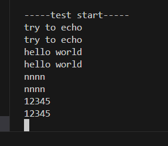
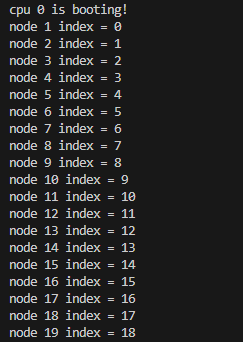
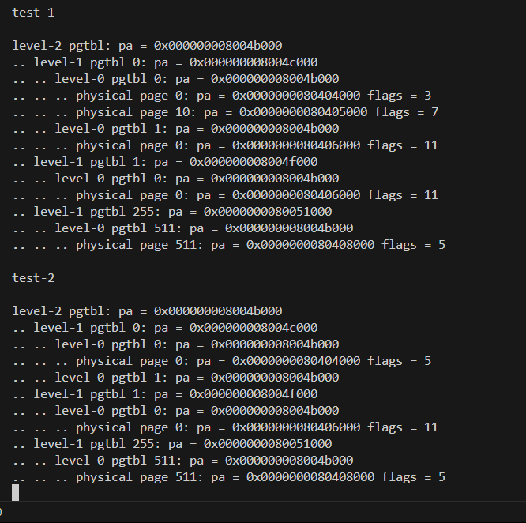

# LAB-3: 中断异常处理 + 第一个用户态进程

## 代码组织结构

ECNU-OSLAB  
├── include  
│   ├── dev  
│   │   ├── timer.h **(NEW)**   
│   │   ├── plic.h **(NEW)**  
│   │   └── uart.h  
│   ├── lib  
│   │   ├── print.h  
│   │   ├── lock.h  
│   │   └── str.h  
│   ├── proc  
│   │   └── cpu.h  
│   ├── mem  
│   │   └── pmem.h  
│   │   └── vmem.h  
│   ├── trap  
│   │   └── trap.h **(NEW)**   
│   ├── common.h  
│   ├── memlayout.h  
│   └── riscv.h  
├── kernel  
│   ├── boot  
│   │   ├── main.c **(CHANGE)**  
│   │   ├── start.c **(CHANGE)**  
│   │   ├── entry.S  
│   │   └── Makefile  
│   ├── dev  
│   │   ├── uart.c  
│   │   ├── timer.c **(TODO)**  
│   │   ├── plic.c **(NEW)**  
│   │   └── Makefile  
│   ├── lib  
│   │   ├── print.c  
│   │   ├── spinlock.c  
│   │   ├── str.c  
│   │   └── Makefile    
│   ├── proc  
│   │   ├── cpu.c  
│   │   └── Makefile  
│   ├── mem  
│   │   ├── pmem.c  
│   │   ├── kvm.c  
│   │   └── Makefile  
│   ├── trap  
│   │   ├── trap_kernel.c **(TODO)**  
│   │   ├── trap.S **(NEW)**  
│   │   └── Makefile **(NEW)**   
│   ├── Makefile  
│   └── kernel.ld  
├── Makefile  
└── common.mk  

**标记说明**

1. **TODO** 本次新增的文件 + 其中有函数待实现 (核心部分)

2. **NEW**  本次新增的文件 + 无需做修改 (辅助部分)

3. **CHANGE** 本来就有的文件 + 需要做修改 或 助教做了修改 (整体兼容)

## 第一阶段: 内核态中断异常处理

在上一个实验的最后, 我们向内核页表里做了 **PLIC** 和 **CLINT** 的映射

在这一次实验中, 我们会把它们用起来, 它们是risc-v的中断控制器

PLIC: platform-level interrupt controller 主要负责管理外部设备产生的中断

CLINT: core local interrupt 主要用于管理与处理器核心相关的时钟中断和软件中断

### 1. 陷阱、中断、异常

在RISC-V里, **陷阱(trap)** 分为 **中断(interrupt)** 和 **异常(exception)**

它们的共同特征是打断当前正常执行程序流, 进入指定的处理程序流, 处理结束后返回正常

区别在于: 中断是同步的, 异常是异步的; 另外, 假设指令 A B C 顺序执行

如果在执行B时发生中断, 中断处理函数处理完后, PC 指向B的下一条指令C

如果在执行B时发生异常, 异常处理函数处理完后, PC 指向B本身(再尝试执行一次B)

**中断分为三种: 时钟中断, 软件中断, 外设中断**

**异常种类更多: 缺页异常, load异常, store异常, 非法指令, 系统调用等**

这里给出一个RISC-V常用的陷阱表格

### 2. 具体任务

**支持内核态的中断异常处理, 主要是最基本的两种中断: 时钟中断 + uart输入中断**

本次实验需要修改的目录包括 **boot dev trap**

#### 第一步, 关注 **dev** 里面的 **timer.c**

这个文件里的函数被分成了两部分, 一部分工作在 **M-mode**, 一部分工作在 **S-mode**

工作在 **M-mode** 的 `timer_init()` 要与 **trap.S** 里的 `timer_vector` 紧密合作

时钟中断的原理是: 

物理时钟会不停 **di da**, 带动 当前滴答数寄存器 **MTIME** 不断 +1

还有一个滴答数比较寄存器 **MTIMECMP**, 这个寄存器每时每刻都会和 **MTIME** 寄存器做比较

一旦两者相同, 就会触发一次时钟中断, 程序流跳转到 **mtvec** 寄存器中存储的地址

于是我们可以确定一个滴答数 **INTERVAL**, 先初始化 **MTIMECMP** = **MTIME** + **INTERVAL**

这样过 **INTERVAL** 个滴答后会触发第一次时钟中断

此后每触发一次时钟中断, 只需更新 **MTIMECMP** = **MTIMECMP** + **INTERVAL**

就能每隔 **INTERVAL** 个滴答触发一次时钟中断

于是我们获得了新的时间单元 tick, **1 tick = INTERVAL * 1 di da**

当完成 `timer_init()` 后, 可以回过头完善 **start.c** 中的 `start()`

之后编写工作在 **S-mode** 的几个函数, 它们只需简单维护系统时钟即可

#### 第二步, 简单阅读 **dev** 目录下的 **plic.c** 里的几个函数

#### 第三步, 关注 **trap** 目录下的 **trap_kernel.c**

首先阅读 **trap.S** 里面的 **kernel_vector**

相关函数的实现顺序是: `trap_kernel_init()`->`trap_kernel_inithart()`->

`external_interrupt_handler()`->`timer_interrupt_handler()`->`trap_kernel_handler()`

几个需要注意的地方:

- 目前不处理任何异常, 发生了就报错卡死即可

- xv6 的 `trap.c` 写的比较乱, 考虑如何重写它的逻辑

- 建议在`trap_kernel_handler()`里使用 **trap_id** 进行 `switch case` 分类处理

- **S-mode** 的中断默认是关闭的, 需要在某个函数里打开(`intr_on()`)

- 时钟中断默认是在 **M-mode** 处理, 注意它是如何被抛到 **S-mode** 处理的

- 系统时钟的更新只需要单个CPU去做即可

- `external_interrupt_handler()` 遇到的中断号可能是0, 直接忽略即可

- 发生意料之外的情况时尽量输出有用信息(比如一些寄存器的值, 错误原因等)

总而言之, 本阶段的关键是理解 `kernel_vector` 与 `trap_kernel_handler()`

`timer_vector` 与 `timer_init()` 如何进行合作, 以完成基本的陷阱响应

## 第一阶段测试

**1. 时钟滴答测试, 在合适的地方加一行滴答输出**

**2. 时钟快慢测试, 在合适的地方加一行ticks输出**

修改 **INTERVAL**, 观察ticks输出速度体会时钟滴答的快慢

**3. UART输入响应测试, 验证是否能使用键盘输入字符**

注意: 目前并不支持特殊字符, 如回车、换行、删除等