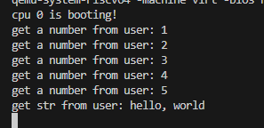

# LAB-8: 文件系统 之 上层抽象

## 代码组织结构

ECNU-OSLAB  
├── **include**  
│   ├── dev  
│   │   ├── virtio.h   
│   │   ├── vio.h  
│   │   ├── timer.h   
│   │   ├── plic.h  
│   │   └── uart.h  
│   ├── lib  
│   │   ├── print.h  
│   │   ├── lock.h  
│   │   └── str.h **(CHANGE)** 新增strlen  
│   ├── proc  
│   │   ├── proc.h  
│   │   ├── initcode.h  
│   │   └── cpu.h  
│   ├── mem  
│   │   ├── mmap.h  
│   │   ├── pmem.h  
│   │   └── vmem.h  
│   ├── fs  
│   │   ├── buf.h  
│   │   ├── fs.h  
│   │   ├── dir.h **(NEW)**  
│   │   ├── inode.h **(NEW)**  
│   │   └── bitmap.h **(CHANGE)** 考虑到和目录的一致性, inode_num改为uint16  
│   ├── trap  
│   │   └── trap.h  
│   ├── syscall  
│   │   ├── syscall.h  
│   │   ├── sysfunc.h  
│   │   └── sysnum.h  
│   ├── common.h  
│   ├── memlayout.h  
│   └── riscv.h  
├── **kernel**  
│   ├── boot  
│   │   ├── main.c  
│   │   ├── start.c  
│   │   ├── entry.S  
│   │   └── Makefile  
│   ├── dev  
│   │   ├── virtio.c  
│   │   ├── uart.c  
│   │   ├── timer.c  
│   │   ├── plic.c  
│   │   └── Makefile  
│   ├── lib  
│   │   ├── print.c  
│   │   ├── spinlock.c  
│   │   ├── sleeplock.c   
│   │   ├── str.c **(CHANGE)** 新增strlen  
│   │   └── Makefile  
│   ├── proc  
│   │   ├── cpu.c  
│   │   ├── proc.c  
│   │   ├── swtch.S  
│   │   └── Makefile  
│   ├── mem  
│   │   ├── pmem.c  
│   │   ├── kvm.c  
│   │   ├── uvm.c  
│   │   ├── mmap.c  
│   │   └── Makefile  
│   ├── fs  
│   │   ├── buf.c  
│   │   ├── fs.c **(CHANGE)** 日常更新  
│   │   ├── bitmap.c **(CHANGE)** 考虑到和目录的一致性, inode_num改为uint16  
│   │   ├── inode.c **(TODO)**  
│   │   ├── dir.c **(TODO)**  
│   │   └── Makefile  
│   ├── syscall  
│   │   ├── syscall.c  
│   │   ├── sysfunc.c  
│   │   └── Makefile  
│   ├── trap  
│   │   ├── trap_kernel.c  
│   │   ├── trap_user.c  
│   │   ├── trap.S  
│   │   ├── trampoline.S  
│   │   └── Makefile  
│   ├── Makefile  
│   └── kernel.ld  
├── **mkfs**  
│   ├── mkfs.c **(CHANGE)** 日常更新  
│   └── Makefile  
├── **user**  
│   ├── syscall_arch.h  
│   ├── syscall_num.h  
│   ├── sys.h  
│   ├── type.h  
│   ├── initcode.c  
│   └── Makefile  
├── Makefile  
└── common.mk

## 实验概况

在上一次实验中, 我们做了三件事:

- 磁盘创建 (mkfs.c)

- 磁盘驱动 (virtio.c)

- 磁盘的底层管理 (buf.c fs.c bitmap.c)

对于上层来说, 本质是在内存中提供了一个虚拟磁盘, 使得上层不用关心磁盘驱动和磁盘硬件

只需通过buf.c和bitmap.c提供的接口即可管理磁盘, 很明显, 这部分和文件系统没有太大联系

这一次我们将在上一次实验的基础上, 完成文件系统里最重要的元数据管理: inode 和 dirent

首先做一些小的修补: 增加strlen函数获取字符串长度; 修改bitmap里inode的部分, 使得返回值变成uint16

这次实验可以分为四个步骤:

1. 理解 mkfs.c 做了哪些事情, 和上次相比, 磁盘发生了什么变化

2. 完成 inode.c 里面的函数, 理解 "磁盘里的inode与内存里的inode" "inode元数据与数据"

3. 完成 dir.c 里的第一部分, 理解 "目录" 这种结构化文件的构成和管理

4. 完成 dir.c 里的第二部分, 理解文件路径是如何确定 inode 的

## step-1: 磁盘中根目录的建立

上一次实验中, 磁盘只有 superblock 区域做了设置, 其他区域全部都是0

这一次, 我们添加了根目录 (根目录没有名字, inode_num也是确定的, 这里设为0)

这意味着会申请一个inode管理这个目录 (修改inode bitmap)

inode region 区域有一个inode会被赋值 (元数据区域)

还会申请一个block用于存放更目录的数据： "." 和 ".." 这两个目录项 (修改block bitmap)

## step-2: inode的管理

inode的管理模式和之前大家见过的 mmap_region, proc, buf 都是类似的

```c
// 内存中的inode资源 + 保护它的锁
#define N_INODE 32
static inode_t icache[N_INODE];
static spinlock_t lk_icache;
```

声明一个全局的资源仓库, 并向外部提供申请和释放资源的接口

出于简化考虑, 仓库的组织形式和procs仓库一致, 采用数组的形式组织

inode_init()函数负责仓库的初始化

```c
typedef struct inode {
    // 磁盘里的inode信息 (由slk保护)
    uint16 type;                // inode 管理的文件类型
    uint16 major;               // 设备文件使用: 主设备号
    uint16 minor;               // 设备文件使用: 次设备号
    uint16 nlink;               // 链接数量 (nlink个文件名链接到这个inode)
    uint32 size;                // 文件大小 (字节)
    uint32 addrs[N_ADDRS];      // 文件存储在哪些block里 (分为一级 二级 三级)

    // 内存里的inode信息
    uint16 inode_num;           // inode序号
    uint32 ref;                 // 引用数 (由lk_icache保护)
    bool valid;                 // 上述磁盘里inode字段的有效性 (由slk保护)
    sleeplock_t slk;            // 睡眠锁
} inode_t;
```

这里给出了inode的结构体定义, 基本和xv6保持一致, 去除了我们暂时用不到的 dev 字段

在本次实验中 major + minor + nlink 字段也几乎不会使用

字段的具体含义和用法建议阅读xv6的注释和说明书, 尤其需要关注slk和lk_icache的使用, 这里不做详细介绍

可以看到, inode的定义分为了两部分: 磁盘里的字段(inode_disk_t in mkfs.c) + 内存里新加的字段

首先关注磁盘里的字段, 当这些字段被修改后, 需要在特定时机写回磁盘, 以保证磁盘和内存的一致性

在申请一个空闲的inode时, 也需要把磁盘里的inode读入以初始化这些磁盘里的字段

所以需要完成 inode_rw() 函数来做让磁盘和内存同步的工作 (使用buf.c提供的接口)

inode_alloc() inode_create() inode_free() 这组函数是申请和释放inode资源使用的

申请资源分为两种情况:

1. 确定磁盘里有inode-x: 那么直接申请一个空闲inode并把它的inode_num设为x即可 (先不从磁盘读出)

    或者在查询过程中发现icache命中了这个inode, 那么直接返回这个inode即可

2. 创建一个磁盘里没有的inode-x: 那么icache不可能命中, 首先申请一个空闲inode (磁盘和内存都要申请), 

    赋值成你想要的样子, 随后写入磁盘, 最后返回这个inode即可

第一种情况应该调用 inode_alloc(inode_num) 第二种情况应该调用inode_create(type, major, minor)

释放资源也分为两种情况:

1. 只是在内存里释放这个inode: inode->ref 减到 0, 代表这个 inode 进入可分配状态

2. 在磁盘里也要删除这个inode: 需要调用 inode_destroy() 释放这个 inode 在磁盘占用的空间

这两种情况都是调用 inode_free() 完成, 只需要在内部做一个判断即可

你应该注意到一件事: 和buf不用, 申请得到的inode资源是不上锁的, 释放inode资源时也不必持有锁

所以还需要一组 inode_lock() 和 inode_unlock() 函数负责上锁和解锁

其中 inode_lock() 还需要检查 valid 字段, 判断是否需要从磁盘读入inode来更新内存里的inode

最后, 为了使用方便, 还提供了一个 inode_unlock_free() 函数一口气解锁和释放inode

完成这些函数后, inode元数据的管理基本成型, 下面关心inode的数据管理

inode 里的 size 和 addrs 字段服务于数据管理

首先解释addrs数组的结构:

- 最前面的 N_ADDRS_1 个元素直接存放 block_num (一级映射)

- 中间的 N_ADDRS_2 个元素存放的 block_num 不是数据block, 而是索引block

    索引block由连续的entry构成, 每个entry存放一个block_num (二级映射) 

- 最后的 N_ADDRS_3 个元素存放的是索引block的索引block (三级映射)

逻辑上接近之前用过的页表

出于简化考虑, 这个 “页表” 只会顺序增大, 不会出现删除和不连续的情况

从文件角度理解: 只有read和write操作, 没有delete操作

首先你需要完成 inode_locate_block() 函数, 它负责把逻辑上的inode第bn块block转换成

物理上的磁盘第bx个block, 如果bn不存在(比现有的最大bn大1), 则申请新的block并返回block_num

你可以使用助教提供的locate_block()函数帮助完成这个函数, 理解它的逻辑并考虑传入什么参数

完成 inode_locate_block() 后, 可以动手实现 inode_read_data() 和 inode_write_data()

他们会用到 inode_locate_block() 和 buf.c 提供的接口

最后需要完成 inode_data_free(), 负责释放所有inode管理的数据区域, data_free()会提供帮助

完成这部分后, inode的数据管理也成型了, 让我们做一些测试

## test-1: inode的创建与删除

```c
    // in fs_init()

    // inode初始化
    inode_init();

    // 原本就存在的inode
    inode_t* ip = inode_alloc(INODE_ROOT);
    inode_lock(ip);
    inode_print(ip);
    inode_unlock(ip);
    bitmap_print(sb.inode_bitmap_start);

    // 创建新的inode
    inode_t* nip = inode_create(FT_FILE, 0, 0);
    inode_lock(nip);
    inode_print(nip);
    inode_unlock(nip);
    bitmap_print(sb.inode_bitmap_start);

    // 尝试删除inode
    inode_lock(nip);
    nip->nlink = 0;
    inode_unlock_free(nip);
    bitmap_print(sb.inode_bitmap_start);
```

理想的测试结果如图:


## test-2: inode简单读写

```c
    // in fs.c fs_init()
    // 在函数外声明两个个大小为 2*BLOCK_SIZE 的数组 str 和 tmp
    // blockcmp 函数负责比较两个大小为 2*BLOCK_SIZE 的空间是否完全一样

    // inode初始化
    inode_init();
    uint32 ret = 0;

    for(int i = 0; i < BLOCK_SIZE * 2; i++)
        str[i] = i;

    // 创建新的inode
    inode_t* nip = inode_create(FT_FILE, 0, 0);
    inode_lock(nip);
    
    // 第一次查看
    inode_print(nip);

    // 第一次写入
    ret = inode_write_data(nip, 0, BLOCK_SIZE / 2, str, false);
    assert(ret == BLOCK_SIZE / 2, "inode_write_data: fail");

    // 第二次写入
    ret = inode_write_data(nip, BLOCK_SIZE / 2, BLOCK_SIZE + BLOCK_SIZE / 2, str + BLOCK_SIZE / 2, false);
    assert(ret == BLOCK_SIZE +  BLOCK_SIZE / 2, "inode_write_data: fail");

    // 一次读取
    ret = inode_read_data(nip, 0, BLOCK_SIZE * 2, tmp, false);
    assert(ret == BLOCK_SIZE * 2, "inode_read_data: fail");

    // 第二次查看
    inode_print(nip);
    
    inode_unlock_free(nip);

    // 测试
    if(blockcmp(tmp, str) == true)
        printf("success");
    else
        printf("fail");

    while (1); 
```

理想的测试结果如下:


## test-3: inode大量读写

```c
    // in fs_init()
    // 在函数外声明三个大小为BLOCK_SIZE的数组 str, tmp, empty
    // blockcmp 函数负责比较两个大小为BLOCK_SIZE的空间是否完全一样

    // inode初始化
    inode_init();
    uint32 ret = 0;

    for(int i = 0; i < BLOCK_SIZE; i++) {
        str[i] = i;
        empty[i] = 0;
    }

    // 创建新的inode
    inode_t* nip = inode_create(FT_FILE, 0, 0);
    inode_lock(nip);
    
    // 第一次查看
    inode_print(nip);
    bitmap_print(sb.data_bitmap_start);

    uint32 max_blocks =  N_ADDRS_1 + N_ADDRS_2 * ENTRY_PER_BLOCK + 2 * ENTRY_PER_BLOCK;

    for(uint32 i = 0; i < max_blocks; i++)
    {
        ret = inode_write_data(nip, i * BLOCK_SIZE, BLOCK_SIZE, str, false);
        assert(ret == BLOCK_SIZE, "inode_write_data fail");
    }
    ret = inode_write_data(nip, (max_blocks - 2) * BLOCK_SIZE, BLOCK_SIZE, empty, false);
    assert(ret == BLOCK_SIZE, "inode_write_data fail");
    
    // 第二次查看
    inode_print(nip);

    // 区域-1
    ret = inode_read_data(nip, BLOCK_SIZE, BLOCK_SIZE, tmp, false);
    assert(ret == BLOCK_SIZE, "inode_read_data fail");
    assert(blockcmp(tmp, str), "check-1 fail");
    printf("check-1 success\n");

    // 区域-2
    ret = inode_read_data(nip, N_ADDRS_1 * BLOCK_SIZE, BLOCK_SIZE, tmp, false);
    assert(ret == BLOCK_SIZE, "inode_read_data fail");
    assert(blockcmp(tmp, str), "check-2 fail");
    printf("check-2 success\n");

    // 区域-3
    ret = inode_read_data(nip, (max_blocks - 2) * BLOCK_SIZE, BLOCK_SIZE, tmp, false);
    assert(ret == BLOCK_SIZE, "inode_read_data fail");
    assert(blockcmp(tmp, empty), "check-2 fail");
    printf("check-3 success\n");

    // 释放inode管理的所有data block
    inode_free_data(nip);
    printf("free success\n");

    // 第三次观察
    inode_print(nip);
    bitmap_print(sb.data_bitmap_start);

    inode_unlock_free(nip);
    
    while (1);
```
理想的测试结果如下:



## step-3: 目录项管理

inode管理的实现想必并不轻松, 因为它结构复杂, 功能强大, 是核心的元数据结构

而目录项管理这部分更接近 bitmap 的管理, 难度并不大

目录是一种特殊的结构化文件, 它由若干目录项 (directroy entry 简称 dirent) 组成

```c
typedef struct dirent {
    uint16 inode_num;
    char name[DIR_NAME_LEN];
} dirent_t;
```

目录在磁盘和内存的定义是一样的, 由 inode_num 和 目录名 两部分组成

本质是表征从目录名到inode_num的单向映射关系(一个目录名对应一个inode, 一个inode可以有多个目录名)

一个inode可以有多个目录名涉及链接的问题(nlink), 在下一次实验中详细展开

这里我们还做了一个简化假设: 目录文件只能管理一个block(32个entry), 只有addrs[0]是有效的

目录项管理包括三个函数: dir_search_entry() dir_add_entry() dir_delete_entry()

他们的含义可以参考注释, 实现后需要做一个测试

## test-4: 目录项操作

```c
    // in fs_init()

    // inode初始化
    inode_init();

    // 获取根目录
    inode_t* ip = inode_alloc(INODE_ROOT);    
    inode_lock(ip);

    // 第一次查看
    dir_print(ip);
    
    // add entry
    dir_add_entry(ip, 1, "a.txt");
    dir_add_entry(ip, 2, "b.txt");
    dir_add_entry(ip, 3, "c.txt");
    
    // 第二次查看
    dir_print(ip);

    // 第一次检查
    assert(dir_search_entry(ip, "b.txt") == 2, "error-1");

    // delete entry
    dir_delete_entry(ip, "a.txt");
   
    // 第三次查看
    dir_print(ip);
    
    // add entry
    dir_add_entry(ip, 1, "d.txt");    
    
    // 第四次查看
    dir_print(ip);
    
    // 第二次检查
    assert(dir_add_entry(ip, 4, "d.txt") == BLOCK_SIZE, "error-2");
    
    inode_unlock(ip);

    printf("over");

    while (1); 
```

理想的测试结果:


## step-4: 文件路径处理

所谓文件路径, 指的是由一串文件和目录构成的结构化信息, 如"/user/work/hello.txt"

这里面包含了 根目录 user目录 work目录 和 hello.txt文件

在本次实验中, 所有路径都是绝对路径, 也就是从根目录出发的路径

我们需要提供两个接口函数: path_to_inode() 和 path_to_pinode()

```c
// 找到path对应的inode
inode_t* path_to_inode(char* path)
{
    char name[DIR_NAME_LEN];
    return search_inode(path, name, false);
}

// 找到path对应的inode的父节点
// path最后的目录名放入name指向的空间
inode_t* path_to_pinode(char* path, char* name)
{
    return search_inode(path, name, true);
}
```

它们都依赖 `search_inode()` 提供路径到inode的解析能力

可以预测到, `search_inode()` 的核心操作是 循环或递归 + 路径字符串剥离 + dir_search_entry()

其中字符串剥离函数已经给出 `skip_elements()`, 理解它的用法, 不必深究它的实现细节

实现 `search_inode()` 后, 我们进行最后一个测试

## test-5: 路径解析

```c
    // in fs_init()

    // inode初始化
    inode_init();

    // 创建inode
    inode_t* ip = inode_alloc(INODE_ROOT);
    inode_t* ip_1 = inode_create(FT_DIR, 0, 0);
    inode_t* ip_2 = inode_create(FT_DIR, 0, 0);
    inode_t* ip_3 = inode_create(FT_FILE, 0, 0);

    // 上锁
    inode_lock(ip);
    inode_lock(ip_1);
    inode_lock(ip_2);
    inode_lock(ip_3);

    // 创建目录
    dir_add_entry(ip, ip_1->inode_num, "user");
    dir_add_entry(ip_1, ip_2->inode_num, "work");
    dir_add_entry(ip_2, ip_3->inode_num, "hello.txt");
    
    // 填写文件
    inode_write_data(ip_3, 0, 11, "hello world", false);

    // 解锁
    inode_unlock(ip_3);
    inode_unlock(ip_2);
    inode_unlock(ip_1);
    inode_unlock(ip);

    // 路径查找
    char* path = "/user/work/hello.txt";
    char name[DIR_NAME_LEN];
    inode_t* tmp_1 = path_to_pinode(path, name);
    inode_t* tmp_2 = path_to_inode(path);

    assert(tmp_1 != NULL, "tmp1 = NULL");
    assert(tmp_2 != NULL, "tmp2 = NULL");
    printf("\nname = %s\n", name);

    // 输出 tmp_1 的信息
    inode_lock(tmp_1);
    inode_print(tmp_1);
    inode_unlock_free(tmp_1);

    // 输出 tmp_2 的信息
    inode_lock(tmp_2);
    inode_print(tmp_2);
    char str[12];
    str[11] = 0;
    inode_read_data(tmp_2, 0, tmp_2->size, str, false);
    printf("read: %s\n", str);
    inode_unlock_free(tmp_2);

    printf("over");
    while (1); 
```

理想的测试结果如图:


## 总结

本次实验我们完成了 inode 和 dirent 的管理, 已经具备了提出文件 (file) 这一概念的基本条件

在下一次实验(最后一次), 我们将完成 file 相关的抽象, 完成完整的文件系统并提供相关系统调用

还需整合各个模块, 实现最终的内核