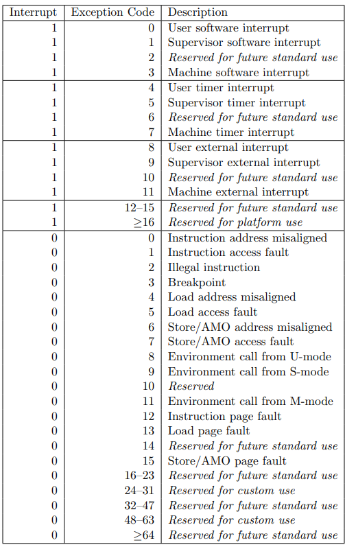
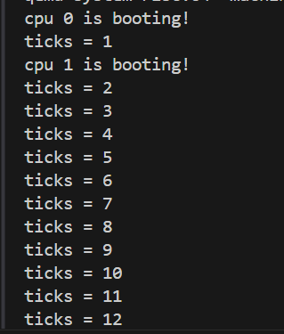

# LAB-9: 文件系统完善与系统整合

## 代码组织结构

ECNU-OSLAB  
├── **include**  
│   ├── dev  
│   │   ├── virtio.h   
│   │   ├── vio.h  
│   │   ├── timer.h   
│   │   ├── plic.h  
│   │   ├── console.h **(NEW)**  
│   │   └── uart.h  
│   ├── lib  
│   │   ├── print.h  
│   │   ├── lock.h  
│   │   └── str.h  
│   ├── proc  
│   │   ├── proc.h **(CHANGE)** 增加文件系统支持  
│   │   ├── elf.h **(NEW)** 支持ELF文件的访问  
│   │   ├── initcode.h  
│   │   └── cpu.h  
│   ├── mem  
│   │   ├── mmap.h **(CHANGE)** mmap_region_alloc 增加初始化选项  
│   │   ├── pmem.h  
│   │   └── vmem.h **(CHANGE)** uvm_heap_grow 增加页面权限选项  
│   ├── fs  
│   │   ├── buf.h  
│   │   ├── fs.h  
│   │   ├── dir.h **(CHANGE)** 新增函数  
│   │   ├── inode.h  
│   │   ├── file.h **(NEW)**  
│   │   └── bitmap.h  
│   ├── trap  
│   │   └── trap.h  
│   ├── syscall  
│   │   ├── syscall.h  
│   │   ├── sysfunc.h **(CHANGE)**  
│   │   └── sysnum.h **(CHANGE)**  
│   ├── common.h  
│   ├── memlayout.h  
│   └── riscv.h  
├── **kernel**  
│   ├── boot  
│   │   ├── main.c **(CHANGE)**  
│   │   ├── start.c  
│   │   ├── entry.S  
│   │   └── Makefile  
│   ├── dev  
│   │   ├── virtio.c  
│   │   ├── uart.c **(CHANGE)** 修改uart_intr()  
│   │   ├── timer.c  
│   │   ├── plic.c  
│   │   ├── console.c **(NEW)** 控制台抽象  
│   │   └── Makefile  
│   ├── lib  
│   │   ├── print.c  
│   │   ├── spinlock.c  
│   │   ├── sleeplock.c   
│   │   ├── str.c  
│   │   └── Makefile  
│   ├── proc  
│   │   ├── cpu.c  
│   │   ├── proc.c **(CHANGE)** 需增加文件系统支持  
│   │   ├── exec.c **(NEW)**  
│   │   ├── swtch.S  
│   │   └── Makefile  
│   ├── mem  
│   │   ├── pmem.c  
│   │   ├── kvm.c  
│   │   ├── uvm.c **(CHANGE)** uvm_heap_grow 增加页面权限选项  
│   │   ├── mmap.c **(CHANGE)** mmap_region_alloc 增加初始化选项  
│   │   └── Makefile  
│   ├── fs  
│   │   ├── buf.c  
│   │   ├── fs.c  
│   │   ├── bitmap.c  
│   │   ├── inode.c  
│   │   ├── dir.c **(TODO)** 添加新的函数  
│   │   ├── file.c **(TODO)**  
│   │   └── Makefile  
│   ├── syscall (sysfunc.c改为sysproc.c)  
│   │   ├── syscall.c **(CHANGE)** 支持更多系统调用  
│   │   ├── sysproc.c **(NEW)**  
│   │   ├── sysfile.c **(NEW)**  
│   │   └── Makefile  
│   ├── trap  
│   │   ├── trap_kernel.c  
│   │   ├── trap_user.c **(TODO)** 处理用户栈溢出带来的缺页异常  
│   │   ├── trap.S  
│   │   ├── trampoline.S  
│   │   └── Makefile  
│   ├── Makefile  
│   └── kernel.ld  
├── **mkfs**  
│   ├── mkfs.c **(CHANGE)**  
│   └── Makefile  
├── **user**  
│   ├── syscall_arch.h  
│   ├── syscall_num.h **(CHANGE)**  
│   ├── sys.h  
│   ├── type.h **(CHANGE)**  
│   ├── userlib.h **(NEW)**  
│   ├── initcode.c **(CHANGE)**  
│   ├── test.c **(NEW)**  
│   ├── user_lib.c **(NEW)**  
│   ├── user_syscall.c **(NEW)**  
│   ├── user.ld **(NEW)**  
│   └── Makefile **(CHANGE)**  
├── Makefile **(CHANGE)**  
└── common.mk

## 任务概览

本次实验是最后一次实验, 任务可以分为以下几个方面:

1. 前期准备: 修改 `mmap_region_alloc()` 和 `uvm_heap_grow()` 两个函数, 并同步修改调用它们的地方

    对于mmap_region_alloc(), 增加一个 bool init 字段, 标记是否需要初始化
    
    初始化指的是: 对申请到的mmap_region做初始赋值, 使得它标记整个mmap_region区域为空闲

    对于uvm_heap_grow(), 增加一个int flags字段, 标记新增内存空间的权限

    之前默认是 PTE_R | PTE_W | PTE_U, 现在需要考虑这个区域可能存放代码 (PTE_X)

2. 完成 dir.c 中新增的函数和 file.c 中的函数, 它们构成了文件系统剩余的部分

    在这个过程中, 你可能需要结合 sysfile.c, 这是文件系统的系统调用接口

    在sysfile.c中, 你会发现它还与进程模块相关, 包括进程的打开文件表和当前目录inode

3. 我们在uart的基础上包装了一层console, 这部分已经实现, 你需要考虑在文件系统何处调用它的接口

    使得我们可以通过访问设备文件的方式进行标准输入和标准输出

4. 最后需要实现一个proc_exec函数, 这个函数可以用于执行一个ELF文件, 它涉及进程、内存、文件系统等多个模块

5. 阅读和理解user目录下的源文件并进行测试, 源文件分为 initcode + 函数库 + 磁盘里可见的文件

6. 有时间的话, 你可以独立完成的任务: 支持管道文件(主要在xv6的pipe.c中实现) 

    用户栈溢出产生的缺页异常处理(利用proc->ustack_pages)

## 测试一
```c 
// 来自 initcode.c
// 后面几个测试也保持这样, 它会调用 test.c 里的测试函数
// 这里传入的参数没有实际意义, 只是检查传参是否成功

#include "sys.h"

int main()
{
    char path[] = "./test";
    char* argv[] = {"hello", "world", 0};

    int pid = syscall(SYS_fork);
    if(pid < 0) { // 失败
        syscall(SYS_write, 0, 20, "initcode: fork fail\n");
    } else if(pid == 0) { // 子进程
        syscall(SYS_write, 0, 22, "\n-----test start-----\n");
        syscall(SYS_exec, path, argv);
    } else { // 父进程
        syscall(SYS_wait, 0);
        syscall(SYS_write, 0, 21, "\n-----test over-----\n");
        while(1);
    }
    return 0;
}
```

```c
// 来自test.c
// 测试目的: 测试 stdin 和 stdout 输入一行然后回车换行
#include "userlib.h"

int main(int argc, char* argv[])
{
    char tmp[128];
    while(1) {
        memset(tmp, 0, 128);
        stdin(tmp, 128);
        stdout(tmp, strlen(tmp));
    }
}

```

理想结果:



## 测试二

```c
// 来自 test.c
// 测试目的: 检测printf的正确性 + exec的传参能力
#include "userlib.h"

int main(int argc, char* argv[])
{
    printf("\nchild arguments: ");
    for(int i = 0; i < argc; i++)
        printf("%s ", argv[i]);
    printf("\n");
    return 0;
}
```

理想输出:


## 测试三

```c

// 来自test.c
// 测试目的: 目录相关的三组操作 + 绝对路径与相对路径
#include "userlib.h"

static int try_to_open(char* path, uint32 mode)
{
    int fd = sys_open(path, mode);
    if(fd < 0) {
        printf("open %s fail\n", path);
        while(1);
    }
    return fd;
}

static void try_to_mkdir(char* path)
{
    int ret = sys_mkdir(path);
    if(ret < 0) {
        printf("mkdir %s fail\n", path);
        while(1);
    }
}

static dirent_t dirents[10];
static uint32 dirlen;

static void try_to_print_dir(char* path, char* dirname)
{
    printf("%s ",dirname);
    int fd = try_to_open(path, MODE_READ);
    dirlen = sys_getdir(fd, dirents, sizeof(dirents));
    dir_print(dirents, dirlen / sizeof(dirent_t));
    sys_close(fd);
}

int main(int argc, char* argv[])
{
    int ret = 0, fd = 0;

    // 输出根目录内容
    try_to_print_dir(".", "root");

    // 在根目录下创建workdir
    // 在workdir下创建student和teacher目录和hello.txt文件
    // 输出workdir的目录项
    try_to_mkdir("/workdir");
    try_to_mkdir("/workdir/student");
    try_to_mkdir("/workdir/teacher");
    fd = try_to_open("./workdir/hello.txt", MODE_CREATE | MODE_READ | MODE_WRITE);
    sys_close(fd);
    try_to_print_dir(".", "root");
    try_to_print_dir("/workdir", "workdir");

    // 修改当前目录项并测试修改是否生效
    ret = sys_chdir("./workdir/student");
    if(ret < 0) {
        printf("chdir fail\n");
        while(1);
    }
    try_to_print_dir("..", "workdir");
    try_to_print_dir("././../..","root");

    return 0;
}

```

理想输出:



## 测试四

```c
// 来自 test.c
// 测试目的: open read write lseek fstat

#include "userlib.h"

static int try_to_open(char* path, uint32 mode)
{
    int fd = sys_open(path, mode);
    if(fd < 0) {
        printf("open %s fail\n", path);
        while(1);
    }
    return fd;
}

int main(int argc, char* argv[])
{
    int ret = 0, fd = 0;

    char str[] = "hello wrold";
    char tmp[15];

    // 创建文件 + 简单读写 + 指针移动 + 文件状态检查

    fd = try_to_open("./hello.txt", MODE_WRITE | MODE_READ | MODE_CREATE);
    ret = sys_write(fd, strlen(str), str);
    printf("write_len = %d\n", ret);
    
    sys_lseek(fd, 11, LSEEK_SUB);
    ret = sys_read(fd, 10, tmp);
    tmp[ret] = 0;
    printf("read_len = %d read = %s\n", ret, tmp);

    sys_lseek(fd, 6, LSEEK_SET);
    ret = sys_read(fd, 10, tmp);
    tmp[ret] = 0;
    printf("read_len = %d read = %s\n", ret, tmp);

    fstat_t fstate;
    sys_fstat(fd, &fstate);
    print_filestate(&fstate);

    sys_close(fd);

    return 0;
}
```

理想结果:


## 测试五

```c
// 来自test.c
// 测试目的: link unlink dup
#include "userlib.h"

static int try_to_open(char* path, uint32 mode)
{
    int fd = sys_open(path, mode);
    if(fd < 0) {
        printf("open %s fail\n", path);
        while(1);
    }
    return fd;
}

static dirent_t dirents[10];
static uint32 dirlen;

static void try_to_print_dir(char* path, char* dirname)
{
    printf("%s ",dirname);
    int fd = try_to_open(path, MODE_READ);
    dirlen = sys_getdir(fd, dirents, sizeof(dirents));
    print_dirents(dirents, dirlen / sizeof(dirent_t));
    sys_close(fd);
}

int main(int argc, char* argv[])
{
    int ret = 0, fd = 0, new_fd = 0;
    char tmp1[10], tmp2[10];

    // 测试 sys_dup
    
    fd = sys_dup(STD_OUT);
    sys_write(fd, 16, "sys_dup success\n");
    sys_close(fd);

    // 测试 sys_link
    
    fd = try_to_open("hello.txt", MODE_READ | MODE_WRITE | MODE_CREATE);
    sys_write(fd, 12, "hello world\n");
    sys_lseek(fd, 6, LSEEK_SET);

    ret = sys_link("hello.txt", "world.txt");
    if(ret < 0) {
        printf("link fail\n");
        while(1);
    }

    new_fd = try_to_open("world.txt", MODE_READ);
    
    sys_read(fd, 5, tmp1);
    sys_read(new_fd, 5, tmp2);
    printf("%s %s\n", tmp1, tmp2);

    // 测试 sys_unlink
    
    try_to_print_dir(".", "root");

    fstat_t fstate;
    sys_fstat(fd, &fstate);
    print_filestate(&fstate);
    sys_unlink("world.txt");

    sys_fstat(fd, &fstate);
    print_filestate(&fstate);
    sys_unlink("hello.txt");

    sys_close(fd);
    sys_close(new_fd);

    try_to_print_dir(".", "root");

    return 0;
}
```

理想结果:

