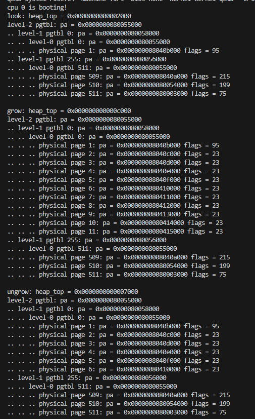
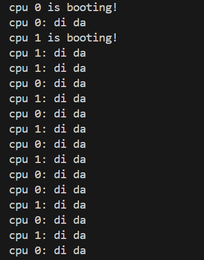

# LAB-5: 用户态虚拟内存管理 + 系统调用流程建立

经历了痛苦的 trap 处理实验后，我们终于可以脱离 RISC-V 体系结构的一大堆寄存器，做一些纯粹的软件设计了

这次实验我们还是围绕第一个用户态进程，关注它的地址空间(虚拟内存)以及它和内核的交互(系统调用)

## 代码组织结构

ECNU-OSLAB  
├── **include**  
│   ├── dev  
│   │   ├── timer.h   
│   │   ├── plic.h  
│   │   └── uart.h  
│   ├── lib  
│   │   ├── print.h  
│   │   ├── lock.h  
│   │   └── str.h  
│   ├── proc  
│   │   ├── proc.h **(CHANGE)** proc_t 里增加 mmap 字段  
│   │   ├── initcode.h  
│   │   └── cpu.h  
│   ├── mem  
│   │   ├── mmap.h **(NEW)**  
│   │   ├── pmem.h  
│   │   └── vmem.h **(CHANEG)** 增加 uvm.c 相关函数定义  
│   ├── trap  
│   │   └── trap.h  
│   ├── syscall  
│   │   ├── syscall.h **(NEW)**  
│   │   ├── sysfunc.h **(NEW)**  
│   │   └── sysnum.h **(NEW)**  
│   ├── common.h  
│   ├── memlayout.h **(CHANGE)** 增加 mmap 相关地址  
│   └── riscv.h  
├── **kernel**  
│   ├── boot  
│   │   ├── main.c **(CHANGE)** 常规更新  
│   │   ├── start.c    
│   │   ├── entry.S  
│   │   └── Makefile  
│   ├── dev  
│   │   ├── uart.c  
│   │   ├── timer.c  
│   │   ├── plic.c  
│   │   └── Makefile  
│   ├── lib  
│   │   ├── print.c  
│   │   ├── spinlock.c  
│   │   ├── str.c  
│   │   └── Makefile    
│   ├── proc  
│   │   ├── cpu.c  
│   │   ├── proc.c **(CHANGE)** 进程初始化过程中增加 mmap 支持  
│   │   ├── swtch.S  
│   │   └── Makefile  
│   ├── mem  
│   │   ├── pmem.c  
│   │   ├── kvm.c  
│   │   ├── uvm.c **(TODO)**  
│   │   ├── mmap.c **(TODO)**  
│   │   └── Makefile  
│   ├── syscall  
│   │   ├── syscall.c **(TODO)**  
│   │   ├── sysfunc.c **(TODO)**  
│   │   └── Makefile **(NEW)**  
│   ├── trap  
│   │   ├── trap_kernel.c  
│   │   ├── trap_user.c **(CHANGE)** 系统调用响应  
│   │   ├── trap.S  
│   │   ├── trampoline.S  
│   │   └── Makefile  
│   ├── Makefile  
│   └── kernel.ld  
├── **user**  
│   ├── syscall_arch.h  
│   ├── syscall_num.h **(CHANGE)** 与内核对齐  
│   ├── sys.h    
│   ├── initcode.c **(CHANGE)** 日常更新  
│   └── Makefile  
├── Makefile  
└── common.mk  

**标记说明**

1. **TODO** 本次新增的文件 + 其中有函数待实现 (核心部分)

2. **NEW**  本次新增的文件 + 无需做修改 (辅助部分)

3. **CHANGE** 本来就有的文件 + 需要做修改 或 助教做了修改 (整体兼容)

## 任务一: 用户态和内核态的数据迁移

在上一个实验中，我们设计了第一个最简单的系统调用 **sys_print**，它的作用就是让内核做出应答

事实上，这并不是系统调用真正的模样。

系统调用的本质是用户给内核传递一个任务请求，内核完成用户的任务请求并返回。

关键问题是信息如何在两者之间传递? 传递的方法分为两种：

- 针对比较短的信息：直接放在约定好的寄存器 (如系统调用编号固定放在 a7 寄存器)

- 针对比较长的信息: 如传递一个数组, 则可以把数组地址放在寄存器里, 内核根据用户页表和地址读出数组内容

同样，内核的返回值可以直接放在寄存器里，内核中太长的信息则直接写入用户地址空间

短信息的传递我们使用 `arg_uint32()` `arg_uint64()` 之类的函数去做 (in syscall.c)

长信息的传递我们使用 `uvm_copyin()` `uvm_copyout()` `uvm_copystr()` 之类的函数去做 (in uvm.c)

你的第一阶段任务是补全系统调用流程 (trap_user_handler -> syscall -> 各个系统调用处理函数)

第二阶段任务是完成上述三个数据迁移函数并理解其对应的系统调用函数做了什么事

注意：这三个系统调用函数只是服务于下面的测试，并不通用

## 测试一

```
// in initcode.c
#include "sys.h"

int main()
{
    int L[5];
    char* s = "hello, world"; 
    syscall(SYS_copyout, L);
    syscall(SYS_copyin, L, 5);
    syscall(SYS_copyinstr, s);
    while(1);
    return 0;
}
```

实验效果：


## 任务二：用户堆空间的伸缩

在上一次实验中, 我们初始化用户的堆顶为 **USER_BASE + PGSIZE**

这意味着堆的实际空间为0，这次实验我们要尝试增加和缩减堆空间以满足用户的地址空间需求

首先，你需要完成 `uvm_heap_grow` 和 `uvm_heap_ungrow` 这两个函数

核心步骤就是对页表的映射和解映射操作，相信这不会太困难

之后，你需要完成 `sys_brk` 系统调用函数

## 测试二

让我们测试 sys_brk 系统调用的正确性

```
// in initcode.c
#include "sys.h"

int main()
{
    long long heap_top = syscall(SYS_brk, 0);

    heap_top = syscall(SYS_brk, heap_top + 4096 * 10);

    heap_top = syscall(SYS_brk, heap_top - 4096 * 5);

    while(1);
    return 0;
}
```

在sys_brk里面做适当输出, 显示最新的 heap_top 和 页表情况

```
    // "look" / "grow" / "ungrow"
    printf("look: heap_top = %p\n", old_heap_top);
    vm_print(p->pgtbl);
    printf("\n");
```



## 任务三: mmap_region_node 仓库管理

之前给出的用户进程地址空间分布中只有堆和栈两个可变区域, 其中堆的管理已经完成，栈的管理是自动的

考虑堆的缺陷：它是一块连续的地址空间，不适合零散的空间需求

本质原因是它只维护了一个栈顶地址，无法记录多块地址空间

什么数据结构更适合做这件事呢？ 毫无疑问是链表！

我们首先划出一块虚拟地址空间 **[MMAP_BEGIN ~ MMAP_END)**, 这块区域位于堆和栈之间

```
typedef struct mmap_region {
    uint64 begin;             // 起始地址
    uint32 npages;            // 管理的页面数量
    struct mmap_region* next; // 链表指针
} mmap_region_t;
```

使用这样的数据结构标记一个未分配的 mmap_region

进程初始化时 mmap_region 只有一块，它管理 **[MMAP_BEGIN ~ MMAP_END)** 整个区域

此时如果来了一个空间申请 **[A, B)**, 则 第一个 mmap_region 分裂为两个

分别管理 **[MMAP_BEGIN, A)** 和 **[B, MMAP_END)** 两块空闲区域，使用 next 指针链接

**[A, B)** 的地址空间则完成页表映射，获得对应物理页，交给用户进程使用

使用完毕后，进程归还这块区域，两个 mmap_region 又合并为一个

至此, mmap_region 的基本设想就完成了, 我们应该注意到一个问题

mmap_region 这样的数据结构是要占据空间的，我们不可能在 proc_t 里面开辟一个 mmap_region_t 的数组

因为这样太不灵活 (数组设置为多大合适呢？ 会不会让 proc_t 太大呢?)

于是，我们可以考虑设置一个全局的 mmap_region_t 仓库，让有需要的进程向仓库申请，获得一个指针

这样，进程只需存储第一个 mmap_region 的指针即可，其他 mmap_region 可以通过 next 找到

新的问题是，我们的 mmap_region 仓库怎么组织呢?

简单的方法是开辟一个数组，缺点是寻找可用的 mmap_region 会比较慢

我的建议是用链表组织 mmap_region 仓库，和物理内存管理的想法一样，还是头插法

由于选择使用链表，所以需要在 mmap_region_t 上再加一层包装构成 mmap_region_node_t

你需要完成 `mmap_init()` `mmap_region_alloc()` `mmap_region_free()` 三个函数 (in mmap.c)

## 测试三

让我们测试仓库的可靠性

未了便于输出, 暂时将 N_MMAP 改为 64, 测试完后恢复

```
    volatile static int started = 0;
    volatile static bool over_1 = false, over_2 = false;
    volatile static bool over_3 = false, over_4 = false;

    void* mmap_list[63];

    int main()
    {
        int cpuid = r_tp();

        if(cpuid == 0) {
            
            print_init();
            printf("cpu %d is booting!\n", cpuid);
            pmem_init();
            kvm_init();
            kvm_inithart();
            trap_kernel_init();
            trap_kernel_inithart();
            
            // 初始化 + 初始状态显示
            mmap_init();
            mmap_show_mmaplist();
            printf("\n");

            __sync_synchronize();
            started = 1;

            // 申请
            for(int i = 0; i < 32; i++)
                mmap_list[i] = mmap_region_alloc(&started);
            over_1 = true;

            // 屏障
            while(over_1 == false ||  over_2 == false);

            // 释放
            for(int i = 0; i < 32; i++)
                mmap_region_free(mmap_list[i]);
            over_3 = true;

            // 屏障
            while (over_3 == false || over_4 == false);

            // 查看结束时的状态
            mmap_show_mmaplist();        

        } else {

            while(started == 0);
            __sync_synchronize();
            printf("cpu %d is booting!\n", cpuid);
            kvm_inithart();
            trap_kernel_inithart();

            // 申请
            for(int i = 32; i < 63; i++)
                mmap_list[i] = mmap_region_alloc(&started);
            over_2 = true;

            // 屏障
            while(over_1 == false || over_2 == false);

            // 释放
            for(int i = 32; i < 63; i++)
                mmap_region_free(mmap_list[i]);
            over_4 = true;
        }
    
        while (1);
    }
```

第一次输出: node 从 1 顺序递增到 64, index 从 0 顺序递增到 63



第二次输出：除了 node 1, 输出由两组单调下降的index混合构成(32->1, 63->33)


## 任务四: mmap 与 munmap 的实现

在上一个任务里，我们实现了 mmap_region_t 的仓库，可以通过 `alloc()` 和 `free()` 获取和释放相关资源

让我们考虑如何使用这些资源实现 mmap 与 munmap 操作

首先应该在 `proc_make_first()` 里初始化 proczero->mmap，此时整个 mmap 区域都是可分配的

随后加入本次实验最困难的部分, uvm.c 里的 `uvm_mmap()` 和 `uvm_munmap()`

首先考虑这两个操作的共同点: 都要修改 **proc->mmap 链 + 用户页表**

区别在于: `uvm_mmap()` 可能产生新的 **mmap_region**, `uvm_munmap()` 可能产生新的或合并已有的 **mmap_region**

注意：我们希望尽可能利用 mmap_region 仓库的资源，所以能合并的 **mmap_region** 尽量合并

这个任务的难点在于链表操作的多种可能性，建议你画图分析，力求不遗漏某种情况

此外，针对合并问题，提供了一个 `mmap_merge()` 函数作为辅助

最后，你需要添加对应的系统调用函数 `sys_mmap()` 和 `sys_munmap()`, 这部分并不困难

## 测试四

我们尽量给出能覆盖所有情况的测试用例，以检测`uvm_mmap()` 和 `uvm_munmap()`中可能的遗漏和错误

```
// in initcode.c
#include "sys.h"

// 与内核保持一致
#define VA_MAX       (1ul << 38)
#define PGSIZE       4096
#define MMAP_END     (VA_MAX - 34 * PGSIZE)
#define MMAP_BEGIN   (MMAP_END - 8096 * PGSIZE) 

int main()
{
    // 建议画图理解这些地址和长度的含义

    // sys_mmap 测试 
    syscall(SYS_mmap, MMAP_BEGIN + 4 * PGSIZE, 3 * PGSIZE);
    syscall(SYS_mmap, MMAP_BEGIN + 10 * PGSIZE, 2 * PGSIZE);
    syscall(SYS_mmap, MMAP_BEGIN + 2 * PGSIZE,  2 * PGSIZE);
    syscall(SYS_mmap, MMAP_BEGIN + 12 * PGSIZE, 1 * PGSIZE);
    syscall(SYS_mmap, MMAP_BEGIN + 7 * PGSIZE, 3 * PGSIZE);
    syscall(SYS_mmap, MMAP_BEGIN, 2 * PGSIZE);
    syscall(SYS_mmap, 0, 10 * PGSIZE);

    // sys_munmap 测试
    syscall(SYS_munmap, MMAP_BEGIN + 10 * PGSIZE, 5 * PGSIZE);
    syscall(SYS_munmap, MMAP_BEGIN, 10 * PGSIZE);
    syscall(SYS_munmap, MMAP_BEGIN + 17 * PGSIZE, 2 * PGSIZE);
    syscall(SYS_munmap, MMAP_BEGIN + 15 * PGSIZE, 2 * PGSIZE);
    syscall(SYS_munmap, MMAP_BEGIN + 19 * PGSIZE, 2 * PGSIZE);
    syscall(SYS_munmap, MMAP_BEGIN + 22 * PGSIZE, 1 * PGSIZE);
    syscall(SYS_munmap, MMAP_BEGIN + 21 * PGSIZE, 1 * PGSIZE);

    while(1);
    return 0;
}
```

你需要在在 `sys_mmap()` 和 `sys_munmap()` 中加入适当输出

```
    uvm_show_mmaplist(p->mmap);
    vm_print(p->pgtbl);
    printf("\n");
```

每次系统调用结束时都有一张 mmap_region 和页表的输出截图 (7 + 7), 见 picture 目录

（图片太多, 无需在你的README里放出截图）

## 任务五：页表的复制和销毁

虽然目前我们只有一个进程且永不退出，但是需要为下一个实验做一些准备

你需要完成页表复制和销毁的函数 `uvm_destroy_pgtbl()` 和  `uvm_copy_pgtbl()`

需要提醒的是: 第一个函数考虑如何使用递归完成；第二个函数深入理解用户地址空间各个区域的特点

## 测试五

根据前四次测试的经验, 思考如何测试, 给出测试方案和结果截图